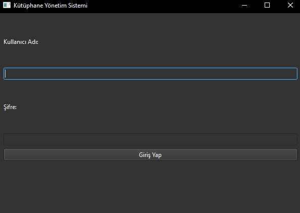
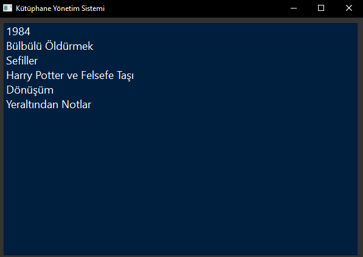
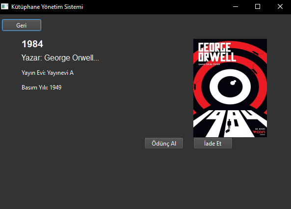
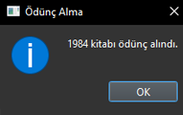
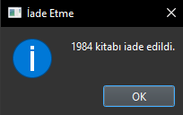

# Kütüphane Yönetim Sistemi

Bu kod, bir kütüphane yönetim sistemi oluşturmak için PyQt6 ve requests kütüphanelerini kullanır.

## Kütüphane Giriş Ekranı
Kodun başlangıcı, kullanıcıya giriş yapma ekranı sunar. Kullanıcı adı ve şifre alanları ile **Giriş Yap** butonu bulunur.

## Giriş Kontrolü
Kullanıcı adı ve şifre *admin* ve *password* olarak kontrol edilir. 

## Kütüphane Ekranı
Başarılı girişten sonra, kullanıcıya kütüphane ekranı sunulur. Burada mevcut kitapların bir listesi yer alır.

## Kitap Detayları
Kullanıcı bir kitaba tıkladığında, kitabın detaylarını görmek için yeni bir pencere açılır. Kitap adı, yazar, yayın evi, basım yılı ve kitap kapağı bu pencerede gösterilir.

## Ödünç Alma ve İade Etme
Kitap detayları penceresinde, kullanıcılar "Ödünç Al" ve "İade Et" butonlarıyla kitapları ödünç alabilir ve iade edebilirler. Bu işlemler onay mesajları ile bildirilir.

Bu kütüphane yönetim sistemi, kullanıcıların giriş yapmasına, kitapları görüntülemesine, detaylarına bakmasına ve ödünç alıp iade etmesine olanak tanır. Hem arayüzü kullanıcı dostudur hem de temel işlevleri hatasız bir şekilde yerine getirir.
